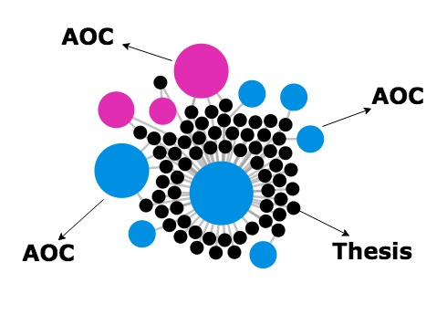

# ThesisLink #

ThesisLink is a web application that visualizes over 50 years of metadata from undergraduate theses by New College of Florida students. It presents users with an alternative: to view undergraduate theses as objects that are associated to each other via what we call intellectual links.

## What are we visualizing ?

ThesisLink visualizes the relationship between theses, divisions and AOCs ( majors ). It is helpful to understand the relationship between difference AOCs and discover multidisciplinary ideas. You can search or click on an AOC, and see all the theses in this AOC with their related AOCs. You can also target specific AOCs ( e. g. Computer Science, Economics, Political Science ) and see all theses that are related to those AOCs. 

## What are the limitations ?

There were a lot of "small AOCs" that are not actually considered as AOCs but maybe topics added in the data. When showing AOCs, we had to limitate the number of AOCs by eliminating the ones that have less than 10 theses. This gave us a clean list of AOCs to list under divisions.

## How is it built ?

**ThesisLink** uses PHP and Python in the backend and HTML, CSS and Javascript with Jquery and D3 libraries in the frontend. D3.js is a powerful Javascript library that brings data to life using HTML, SVG, and CSS and heavily used in the simulation page. Python script is used to scrape theses data from the original digital collection website ( http://ncf.sobek.ufl.edu/theses ) and can be run in any machine that Python is installed.

## Future Work

ThesisLink is helping New College of Florida students, with New College of Florida data. In the future, we want other schools to be able to import their data easily and get an immediate result from ThesisLink. 

## Building

Anyone can build the theses dashboard website using the files in this repository can following these instructions :

- Copy the files to a webserver
- Create a MySQL user and a MySQL database.
- Change the "config.php" file under "system" folder.
- Import the sample sql file in the repository.

To update the theses :

- Edit the MySQL configuration in the scraper (theses.py file).
- Run the Python script.

